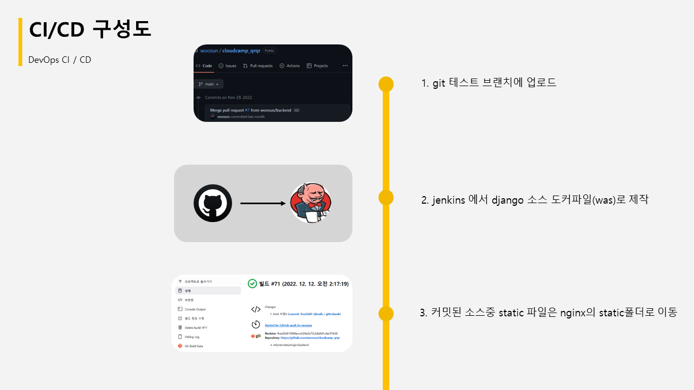

# 2022양주 클라우드 캠프 ㅂㄱㅂㄱ(방가방가)팀 프로젝트 포트폴리오 입니다.

## 팀원
- 박우선, 박태준, 곽희환, 김근우

## 프로젝트 명
- 네이버API와 InfluxDB 시계열 데이터를 활용한 최저가 모니터링 컴퓨터 부품 사이트는 실시간으로 컴퓨터 부품의 최저가격을 모니터링하고, 사용자들에게 최저가격 정보를 제공하는 웹사이트입니다.
- 이 사이트는 다음과 같은 기능을 제공합니다.
  -  부품 검색 기능: 사용자가 검색창에 부품의 이름이나 모델번호를 입력하면, 네이버API를 통해 해당 부품의 최저가격과 판매처 정보를 실시간으로 가져와서 화면에 표시합니다.
  -  부품 모니터링 기능: 사용자가 관심 있는 부품을 선택하면, InfluxDB를 통해 해당 부품의 최저가격과 판매처 정보를 실시간으로 수집하고 저장합니다. 저장된 데이터는 그래프로 시각화하여, 사용자가 해당 부품의 가격 추이를 쉽게 파악할 수 있도록 합니다.
  -  가격 알림 기능: 사용자가 관심 있는 부품의 최저가격이나, 일정 가격 이하로 떨어질 경우 알림을 받을 수 있도록 합니다. 이를 위해 InfluxDB와 함께 작동하는 알림 시스템을 구축하여, 사용자가 등록한 부품의 가격 변동에 따라 이메일이나 SMS 알림을 보내주는 기능을 제공합니다.
  -  커뮤니티 기능: 사용자들끼리 자유롭게 정보를 공유하고, 상품 후기나 평가를 남길 수 있는 커뮤니티 기능을 제공합니다.

- 이러한 기능을 통해, 사용자들은 원하는 부품을 쉽게 찾아 비교하며, 가격 변동에 따라 실시간으로 반응할 수 있습니다. 또한, 다른 사용자들과의 정보 공유를 통해 보다 정확하고 신뢰성 높은 정보를 얻을 수 있습니다.

## 프로젝트 개요
- 장고 기반의 3-Tier 사이트를 개발환경과 라이브환경의 CI/CD구성
- 개발환경과 라이브 환경 모니터링 기능 구현

## 구축환경
- 개발환경
  - Docker 컨테이너 기반 및 Github, jenkins
- 라이브환경
  - AWS 및 Github, AWS 코드파이프라인,빌드,커밋

## 주요 사용기술
 - 사용스킬
   - Nginx,Python(django), Mysql, InfluxDB, NaverAPI
 - 테스트환경(자체서버)
   - Docker, Jenkins
 - 라이브환경(클라우드서버)
   - AWS (EC2,VPN,코드파이프라인,코드빌더,코드커밋)
 - 모니터링
   - InfluxDB, grafana, Amazon CloudWatch,cadvisor,node_exporter, prometheus

## 고려사항
 - 여러 개발자 환경에서의 작업내용의 편리한 CI/CD구축
 - 백업, 로깅,운영의 효율성 및 빠른 확장성, 안정성

## 프로젝트 내용

### 기능구현 및 기능 프로세스

### 팀빌더 노션 및 깃허브 사용방식

### 데브옵스 CI/CD

### 클라우드 라이브서버 CI/CD

### 데브옵스 환경과 클라우드 라이브서버 환경 모니터링 시스템구축

